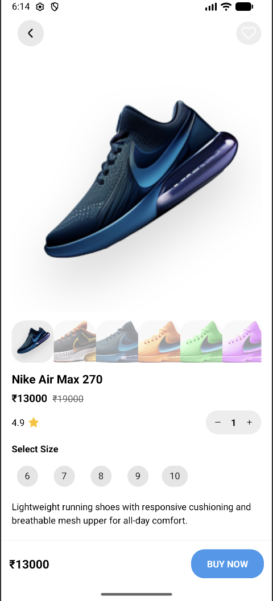
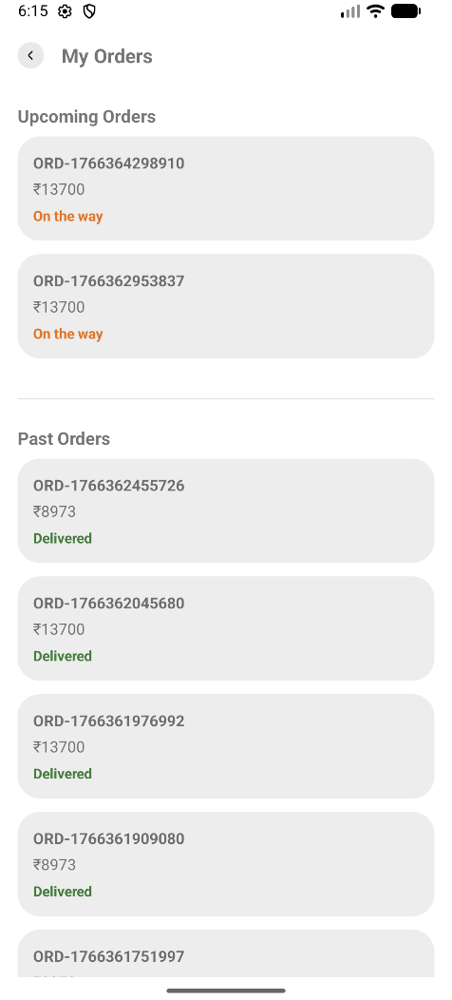
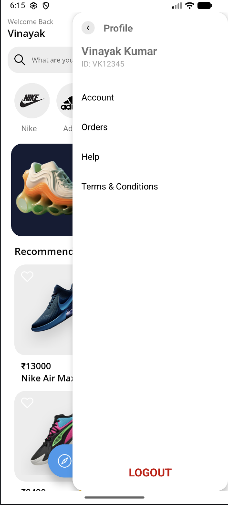
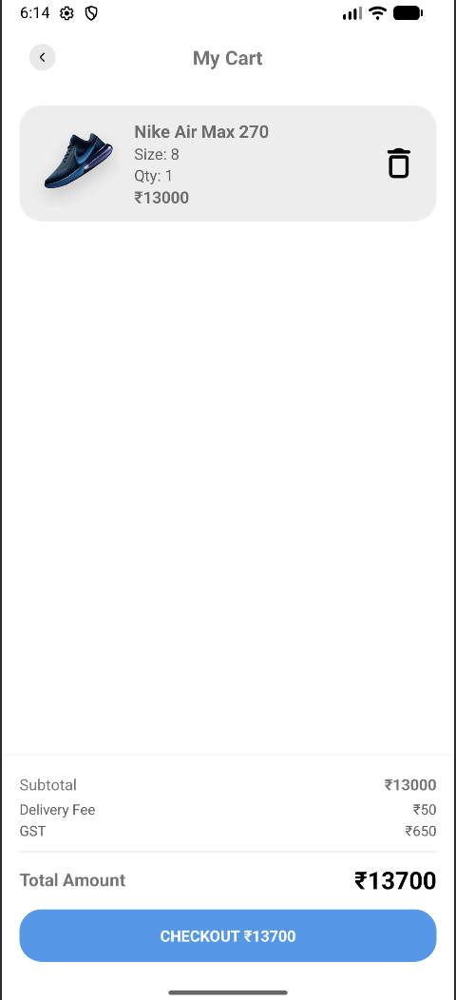

# 👟 Shoes E-Commerce Android App

A modern **Shoes E-Commerce Android application** designed with a clean UI and smooth user experience.  
The app allows users to browse shoes, view product details, manage cart items, and complete the checkout flow seamlessly.

---

## 🎥 App Demo Video

▶️ **Watch full app walkthrough**

[Shoes E-Commerce Demo Video](screenshots/Shoes_commerece.mov)

> GitHub shows videos as downloadable links — this is expected behavior.

---

## 📱 App Screenshots

<p align="center">
  
  
  
</p>

<p align="center">
  
  
  
</p>

<p align="center">
  
  
</p>

---

## ✨ Features

- 🛍️ Browse shoes with modern and clean UI  
- 🔍 Product details with multiple images  
- 🛒 Add, remove, and manage cart items  
- 💳 Smooth checkout flow  
- 🎨 Attractive UI animations  
- 📱 Responsive design for different screen sizes  

---

## 🛠️ Tech Stack

- **Language:** Kotlin  
- **UI:** XML / Jetpack Compose  
- **Architecture:** MVVM  
- **Database:** Room  
- **Image Loading:** Glide  

---
## 🚀 Getting Started

1. Clone the repository
   ```bash
   https://github.com/vinayakkumargupta/Shoes_Ecommerce.git
